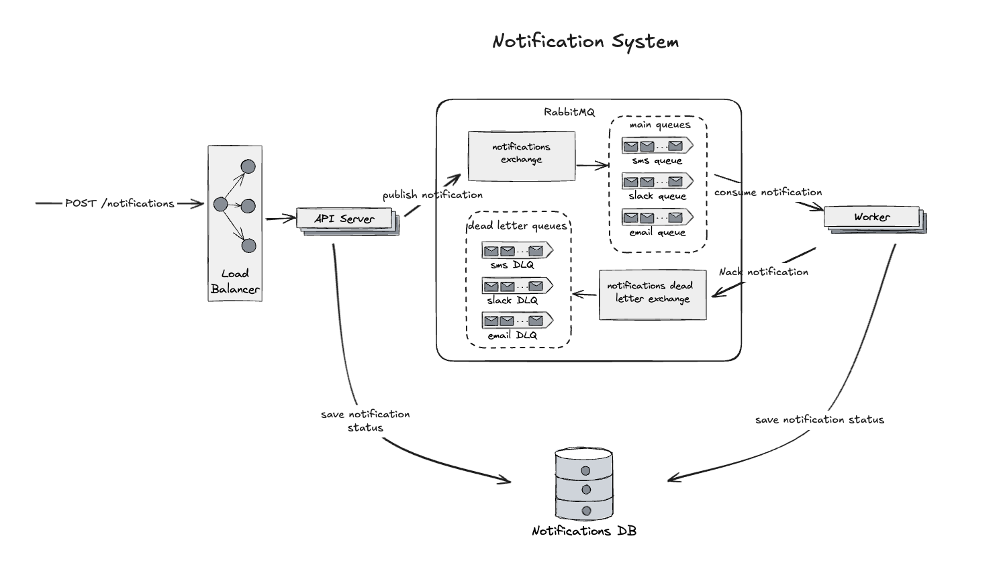

# Notification System

This project implements a notification system having the following requirements:

- The system needs to be able to send notifications via several different channels (email,
  sms, slack) and be easily extensible to support more channels in the future.
- The system needs to be horizontally scalable.
- The system must guarantee an "at least once" SLA for sending the message.
- The interface for accepting notifications to be sent is an HTTP API.

## System Architecture



### Main Components

- **API server** handles the notification requests, validates them and sends the corresponding messages to the RabbitMQ
- **Worker** reads messages from the queues and processes them according the requested message provider
- **Status Database** - both API Server and Worker save notification's current status and the number of attempts tried to send the message
- **Rabbit MQ** receives the messages from the API Server and sends unacknowledged messages to the corresponding DLQ (dead letter queue)

## Usage

The system supports two endpoints

- `POST /notifications` for sending a notification

```curl
// Send sms
curl --location '<api_url>/notifications' \
--header 'Content-Type: application/json' \
--data '{
  "channel": "sms",
  "recipient": "+359888888888",
  "message": "Hello from the notification system!",
}'

// Send a slack message
curl --location '<api-url>/notifications' \
--header 'Content-Type: application/json' \
--data '{
  "channel": "slack",
  "recipient": "C08NKAKQ4N3", // channel ID
  "message": "Hello from the notification system!",
}'

// Send an email

curl --location '<api-url>/notifications' \
--header 'Content-Type: application/json' \
--data-raw '{
  "channel": "email",
  "recipient": "email@example.com",
  "message": "Hello from the notification system!",
  "metadata": {"email_subject": "My subject"}
}'

```

- `GET /notification/:id/status` for getting notification status

```
curl --location '<api-url>/notifications/<notification-id>/status'
```

[This is a Postman collection](https://universal-trinity-803630.postman.co/workspace/At-Kairos~646c5e69-d3c8-456b-8701-b01d8d5711c7/collection/1202446-3827b24f-5aa9-4e05-b38d-82c97b3044f3?action=share&creator=1202446) to which you can also refer.

## Prerequisites

- Go 1.24.1
- Docker
- Ginkgo ( `go install github.com/onsi/ginkgo/v2/ginkgo`)

## Configuration

### .env

Create a `.env` file in the root directory based on `.env.example` and make sure to fill in the proper values there.

### RabbitMQ

To configure RabbitMQ you need a running instance of RabbitMQ to fill in the needed configuration values.

### SMS

The system uses [Twilio](https://www.twilio.com/en-us) for sending sms messages.
Follow the steps provided by Twilio to create an account and an active number.
For test accounts you need to add the numbers that will receive the notifications as verified caller IDs.

### Slack

For Slack notifications, the system uses a Slack app with registered Slack bot token. The app should be added to a Slack workspace and invited to the channel where the notifications will be sent.

### Email (SendGrid)

The system uses [Twilio SendGrid](https://sendgrid.com/) to send emails. You need to provide Twilio Sendgrid API key in .env for the notifications to work properly.

### Database (PostgreSQL)

The database is used to save the current status of each message. It can be checked anytime using the `GET /notifications/:id/status` endpoint.

## How to run locally?

1. Set up your environment:

   ```bash
   cp .env.example .env
   # Edit .env with your configuration as described in the previous section
   ```

1. Start the required services:

   ```bash
   docker-compose up -d
   ```

1. Run the API service:

   ```bash
   go run cmd/api/main.go
   ```

1. Run the worker service (in a separate terminal):
   ```bash
   go run cmd/worker/main.go
   ```

The API will be available at `http://localhost:8080`

## Run tests

```bash
ginkgo -v pkg/validation
```

## How to run in production?

For production deployment:

1. Set up a production-grade PostgreSQL database
1. Configure a production RabbitMQ instance
1. Configure SSL/TLS for secure communication
1. Set up proper environment variables in your deployment environment
1. Build and deploy the API and worker services:

   ```bash
   # Build the services
   go build -o api cmd/api/main.go
   go build -o worker cmd/worker/main.go

   # Deploy the binaries to your production environment
   ```

1. Consider using a process manager like `systemd` or `supervisor` to keep the services running
1. Consider using a load balancer like `nginx` ro route requests to multiple instances of the API server
1. Consider running multiple workers for better scalability
1. Set up proper monitoring and logging
1. Automate infrastructure and deployment using Ansible, Terraform or any other Infrastructure as Code (IaC) tooling

## Future Improvements

- Protect the API with API keys
- Protect the API with rate limiting - both general and per user
- Write more tests to ensure quality
- Support rich formatting of the messages
- Add Slack channel validation for existence and permissions to send messages to that channel
- Document the API with Swagger or similar tool
